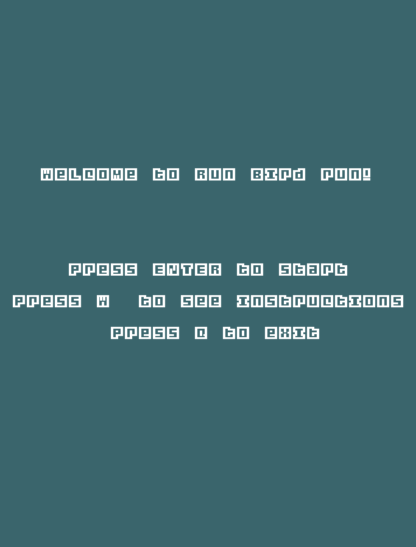
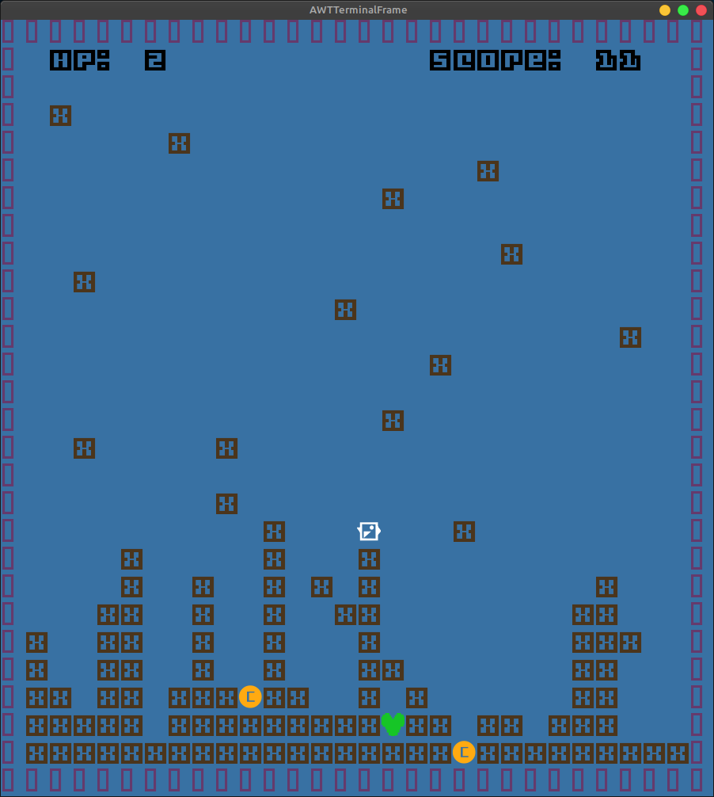
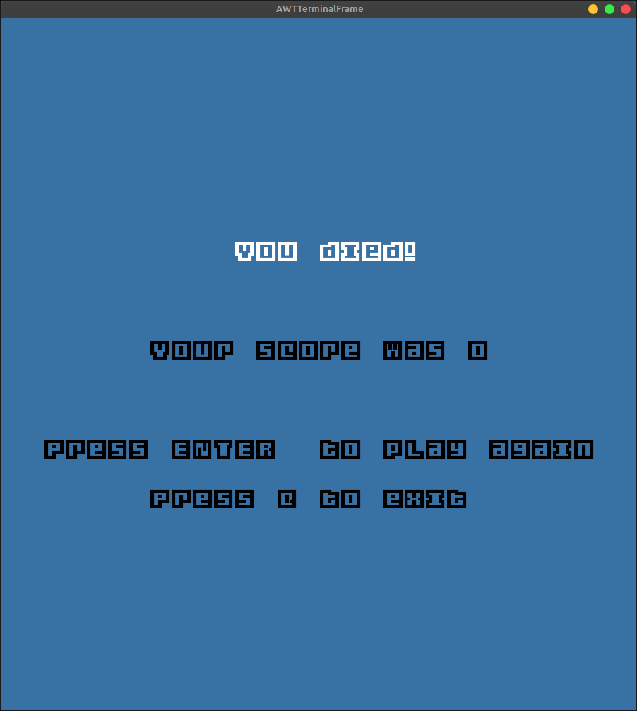
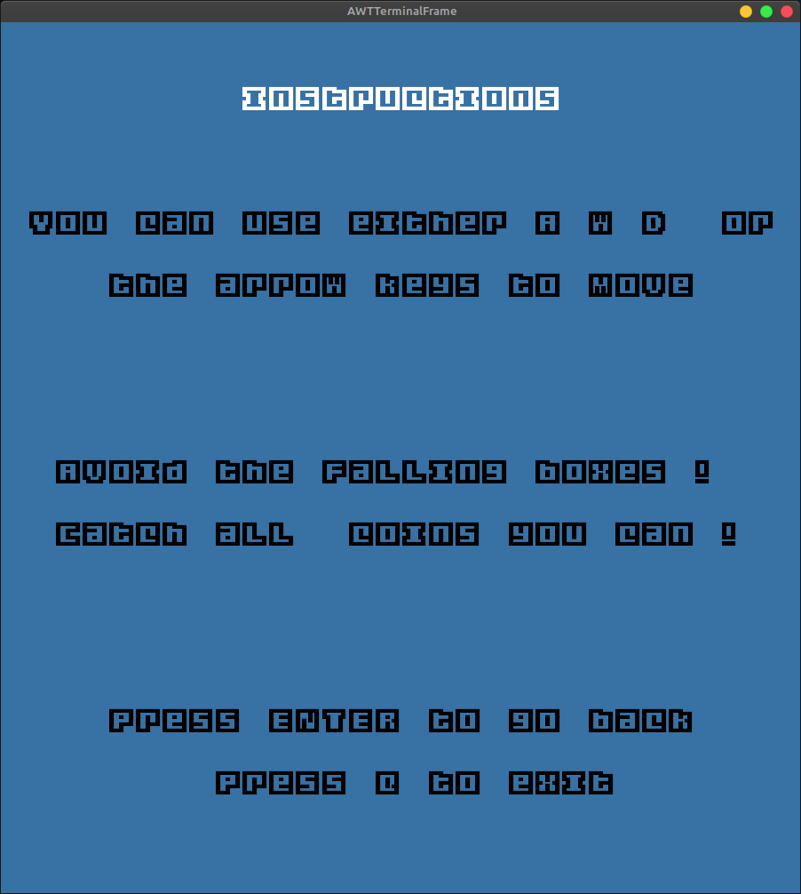

# LDTS_G0900 - Run Bird Run!

[Run Bird Run](https://play.google.com/store/apps/details?id=com.ketchapp.runbirdrun&hl=en_US&gl=US) is a platformer game and a mock version of the mobile phone game with the same
name. The player controls a lazy bird that can't fly much without getting tired. The main objective is to stay alive for as long as you can, while collecting the occasional falling coins. You must avoid the neverending boxes that fall from the sky, otherwise you lose!

## Gameplay images

<table>
  <tr>
    <td >
       
      
Fig 1. Starting Menu

    </td>
    <td >
       
      
Fig 2. Game

    </td>
  </tr>
  <tr>
    <td >
       
      
Fig 3. Game Over

    </td>
    <td >
       
      
Fig 5. Instructions

    </td>
  </tr>
</table>

## More Information

Interested in the project, see the [project report](docs/REPORT.md) for more details.

To play the game in seconds just download this [jar file](RunBird.jar).

Note: The .jar doesn't support some code features:
 - background music
 - sound effects
 - custom font

## Team

This project was developed by at LDTS 2021/2022 by:

| Name     | Email        | 
|----------------|----------------------------|
| Marco André  | up202004891@fe.up.pt   |
| João Alves   | up202007614@fe.up.pt   |
| José Sousa   | up202006141@fe.up.pt   |

