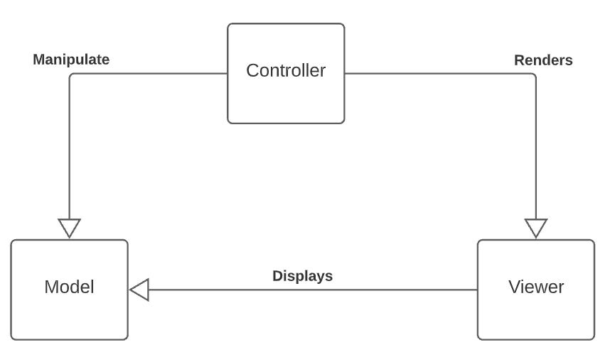
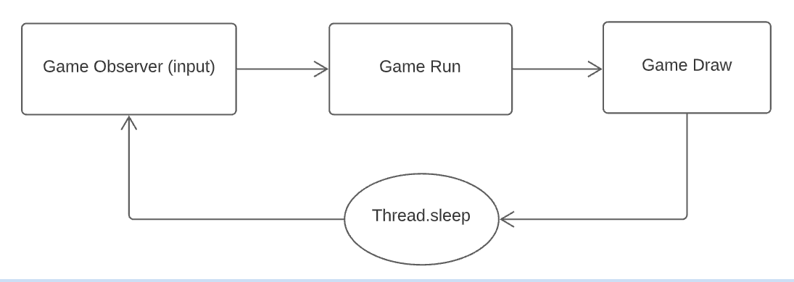
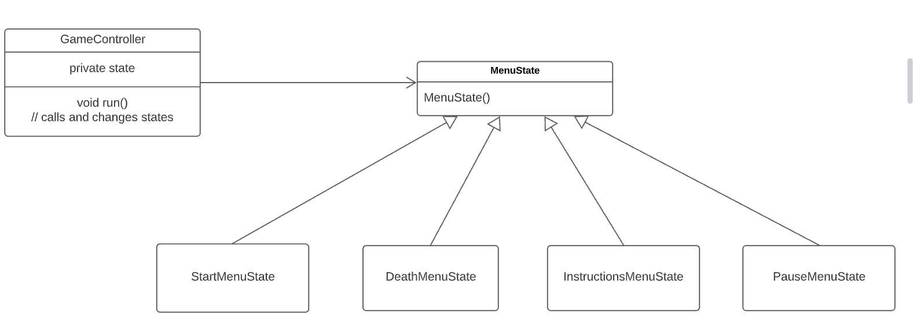
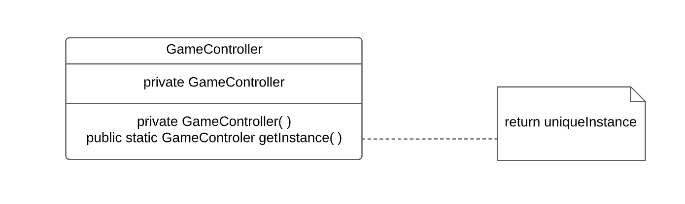
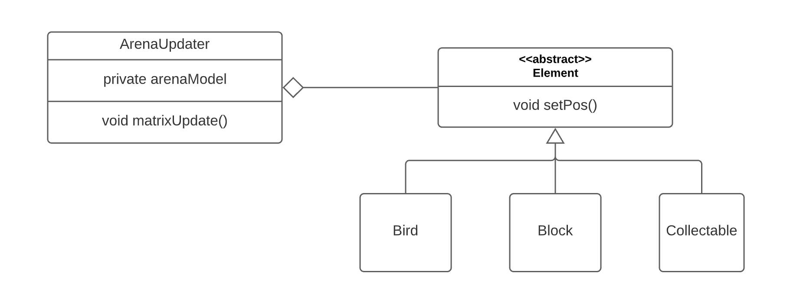
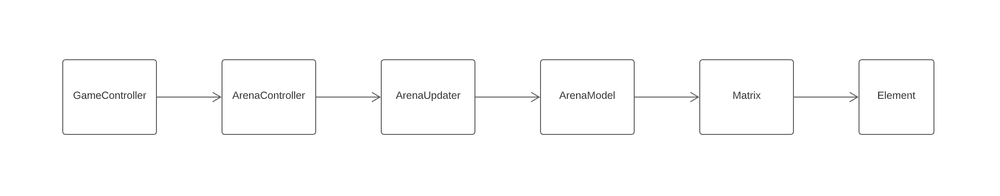

# LDTS_G0900 - Run Bird Run!

Run Bird Run is a platformer game and a mock version of the mobile phone game with the same
name (https://play.google.com/store/apps/details?id=com.ketchapp.runbirdrun&hl=en_US&gl=US). The player controls a lazy
bird that can't fly much without getting tired. The main objective is to stay alive for as long as you can, while
collecting the occasional falling coins. You must avoid the neverending boxes that fall from the sky, otherwise you
lose!

> This project was developed by Marco André (up202004891@fe.up.pt), João Alves (up202007614@fe.up.pt) and José Sousa (up202006141@fe.up.pt) for LDTS 2021/2022.

## Game Demo

  

  <b><i>Gif 1. Gameplay </i></b>  

  

 
 

## Implemented Features

- **Start Screen** - When the game starts a simple initial screen is presented
- **End Screen** - When the player dies, a screen is shown with their score
- **Instructions Screen** - Instruction screens explaining the game and the key inputs
- **Movement** - The game character can move left, right and fly using the Arrow Keys
- **Gravity** - All in-game entities are affected by gravity, thus they fall a small amount per second
- **Catch Coins** - When the bird touches a coin or vice-versa, the player wins a point
- **Take Damage** - When a bird is hit on the head by a block, it takes damage, loosing one of its 3 initial lives
- **Full Bottom Row** - Like in tetriz, when the last row is fully occupied by blocks, it vanishes, preventing the
  window from filling up
- **Collisions** - The bird can't move through blocks or the arena borders. Taking a falling block from above deals damage .If a bird collides with a collectable (lives or coins) they're picked up.
- **Bg Music & Sound Effects** - The game has background music and sound effects when player catches something, dies,
  takes damage...
- **Pausing Game** - Pressing P mid-game pauses the game when needed
- **Play again Option** - In the end screen, the player has the option to play again
- **Bird Stamina** - The player controlled bird now changes color to reflect its stamina. Without stamina, the bird
  can't fly
- **Extra Lives** - Randomly throughout the game, collectable lives drop from the sky. If the player gets them, it gains
  a hp point back.

## Gameplay images

  

  <b><i>Fig 1. Starting Menu </i></b>

  

 
 

  

  <b><i>Fig 2. Game </i></b>  

  

 
 

  

  <b><i>Fig 3. Game Over  </i></b>

  

  

  <b><i>Fig 4. Pause  </i></b>

  

  

  <b><i>Fig 5. Instructions  </i></b>

  

## Planned Features

- **Shop** - With the coins collected in-game, the user can then buy different power-ups, to help him better perform at
  the game.
- **Power-Ups** - These would be special powers, that the user does not have initially. They could vary from "Box
  Destruction" to "Super Coin Addition".
- **Hard Level Meter** - Players could have an option to choose if they want a harder level (with more and faster blocks
  for example)

## Design pattens

### MVC - Model View Controller Pattern

> **Problem in Context**
>
>The project's architecture is the foundation in which the game is built, making it crutial to choose the most correct approach early on, as it can be very demanding to change it deeper in development.
>  With the increasing code size, classes should be organized to facilitate their communication and usage.
>
>
>  **The Pattern**
>
>  Classes should be divided into 3 types : Model (stores data), Controller (coordenates processes and interactions) and Viewer (draws the model into the GUI). The Model does not have dependencies, the View depends on the Model, and the Controller depends on both the Viewer and Model.
>
>  **Implementation**
>
>  The main source directory of the project has three directories that represent one of the MVC elements, they are: Model, View, Controller
>
>  **Consequences**
>
> This code structure is more versatile and every class is organized based on the actions they perform. This means the program is easy to modify and to test because the three elements are separated from each other.

 

  

  <b><i>Fig 6. MVC UML </i></b>  

  

 

___
### Game Loop

> **Problem in Context**
>
>  In a game, we need to take user input, update all Elements values/data and draw them all into the window in a specific time frame (FPS).
>
>  **The Pattern**
>
>  We have applied the **Game Loop** pattern. This pattern runs continuously during gameplay. Each turn of the loop, it processes user input without blocking, updates the game state, and renders the game.
>
>  **Implementation**
>
>  Added a while(gameRun) in the game class in which all the game events take place.
>
>  **Consequences**
>
> We achieve a game that updates whenever we want. It processes user input, but doesn’t wait for it. The loop tracks the passage of time, decoupling the progression of game time from user input and the CPU's frequency.

 

  

  <b><i>Fig 7. Game Loop UML </i></b>  

  

 

___
### State

> **Problem in Context**
>
>  A game can have many different states a player can jump between: we can be in one of the many different menus or actually playing. Therefore, a need to controll the state of the game emerges. We need to be able to track in which state we are and to which states we can transition to.
>
>  **The Pattern**
>
>  We decided to apply the **State** pattern. This is a powerfull pattern that provides to an object the ability to alter its behaviour based on changes to its internal state.
>
>  **Implementation**
>
>  Based on the concepts that guides finite automata (FA), we define some states and the possible transitions between them. On the GameController class we have a state variable that keeps track of the current game state. To implement the FA, the class has a switch statement inside a while loop. Each switch case leads the game to another state and when exiting the current state, the variable is updated to the new state the game should go to.
>
>  **Consequences**
>
> The implementation of the State pattern makes transition between all available game states easy and explicit. There is also the advantage of cleaning polluted and repetitive code with bulky conditions statements and methods that only served the purpose of altering classes' behaviour based on other classes value fields.
>
> The adition of new states is also very pratical, being just a question of adding it to the state switcher after defining its transitions, without ever needing to change the existing states, improving, therefore, state code modularity.

 

  

  <b><i>Fig 8. State UML </i></b>  

  

 

___
### Singleton

> **Problem in Context**
>
>  Between the many classes present in our code, we quickly realize that the class GameController shouldn't need more than one single instance because there is only one game and hence, a need to have a unique controller for that game arises.
>
>  **The Pattern**
>
>  We decided to implement the (anti)pattern **singleton** , ensuring a class has a sigle instance and providing a global point of access to it.
>
>  **Implementation**
>
>  The singleton is easy to implement. We just need to create a static variable inside the class we want to make a singleton, make its constructor private and then provide a global acess point to the variable using a getInstance() method. This method returns the single existing istance or creates one if there isn't one already (null instance).
>
>  **Consequences**
>
> Because we have a single instance for a class, we save CPU time and memory by not having many useless instances. Furthermore, the pattern makes it simple to handle the instance due to the fact we can call the *getInstance()* method and be sure the one and only class we want is called, avoiding a messy code with many class instances scattered throughout the code.
>
>However, being considered an antipattern, singleton isn't all good. Since a single instance exists, coupling is encouraged, therefore making the class harder to test and debug (as we later experienced). Changes to the singleton can also be destructive if done incorrectly because all classes that need/use the instance are affected.

 

  

  <b><i>Fig 9. Singleton UML </i></b>  

  

 

___
### Update

> **Problem in Context**
>
>  We need a effective way to update the position of each element in the arena every game tick
>
>  **The Pattern**
>
>  We have applied the **Update Method** pattern. This pattern allows us to update the position of each of the elements without much complexity.
>  In the arena, we have multiple distinct elements that might change their position in each game cycle, so for each element we call the update method (in this case *setPos()* )
>
>  **Implementation**
>
>  The ArenaUpdater handles the update of all elements. Inside this class, we have the arenaModel that has the game matrix inside it, that checks the interactions
> among the elements, and for each one of them, calls the update method. 
> Since the update method only needs to alter the position, it can be implemented in the abstract class Element.
>
>  **Consequences**
>
> We achieve a game that updates its element's position whenever we want without much complexity.

 

  

  <b><i>Fig 10. Update UML </i></b>  

  

 

___
## UML

  

  <b><i>Fig 11. Complete UML </i></b>  

  

This is the complete project's UML diagram.

See Java Classes here - [Java Classes](src/main/java/birdrun)

 

___
## Code Smells

### Message Chains

 

> **Problem**
> 
> In our code we have multiple successive calls to different objects. One example of this is when we call the *gameState()*
> inside the GameController. Then, successive calls are made to the ArenaController, which then calls the ArenaUpdater 
> when it updates the Arena. After, this object needs the ArenaModel to implement the changes. As a consequence, the Matrix and 
> Element classes are also called.
> 
> This image illustrates the problem descried above:

  

  <b><i>Fig 12. Message Chain UML </i></b>  

  

> **Solution**
> 
> It's possible to solve this code smell. However, that takes away the purpose of creating the Controller, Model, Viewer
> and Updater classes. As such, we believe that this code smell is a consequence of having the MVC design patter, making
> it, a necessary code smell in our program.
>
 

### Shotgun Surgery
 

> **Problem**
> 
> Dispite our atempts to make the code as modular as we could, some features are being delt by more that one class (mainly the two principle controllers: Arena and Game).
>
>For example, if we wanted to add a new *Collectable* (like it is on our *planned features* list), multiple small changes would have to be done to the GameController and the ArenaController in a couple methods to allow this new feature.
>
>   **Solution**
>   
> Therefore, we are facing a *shotgun surgeon* code smell which fix requires us to move the features into a single class, however, we weren't able to make it work without creating other smells in its place.

### Switch Statements
 

>  **Problem**
>  
> In the *KeyboardObserver* class, to get the user's key presses, we used switch statment of considerable dimensions.
> We attempted to fix the issue but other problems arose: the code became very messy due to the fact that a single responsibility had been split up among multiple classes, making changes hard (reminiscent of *shotgun surgeon*).
>
>  **Solution**
>  
>Thus, we opted to keep the switch in detriment of the proposed solution. A simple fix that improved somewhat the code legibility was breaking the great switch into two minor ones: one responsible by arrows and enter keys and another for character keys. 

### Long Method
 

> **Problem**
> 
> Throughout the code, some long class methods can be found. The main examples of this are the methods in the ArenaController responsible for the bird movement and the gravity. 
>
> This large chunks of code are difficult to read and made them harder to test. In an atempt to fix the issue, those methods were broken down into smaller ones but the probleam still remains because the smaller blocks of code are still 20-30 lines each. 
>
>  **Solution**
>  
>The solution would be to use the extract refactoring and fragment the code even more. That would allow for easier testing and make it more legible, however the fragmentation could be too severe.

## Testing

 

  

  <b><i>Fig 13. Coverage Report </i></b>  

  

 

  

  <b><i>Fig 14. Pitest Report </i></b>  

  

 

See full coverage report here - [Coverage Report ](coverage_report/index.html)

See full mutation report here - [Pit Test Report ](pitest_report/index.html)

## Self-Evaluation

- Marco André 40%
- João Alves 30%
- José Sousa 30%
